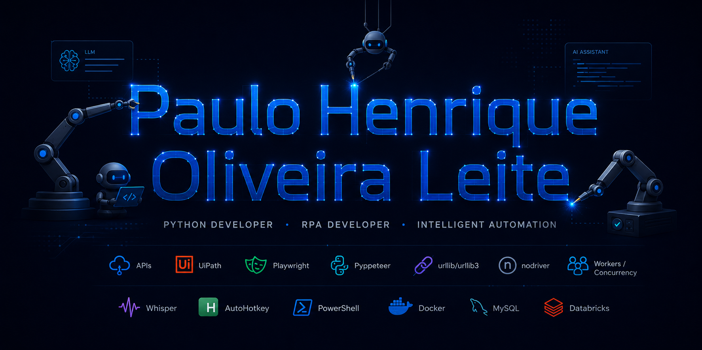

  

 

# Paulo Henrique Oliveira Leite

### Python Developer • RPA Developer • Intelligent Automation

Desenvolvo automações, integrações e soluções orientadas a dados para reduzir atividades manuais, aumentar a rastreabilidade operacional e tornar processos mais confiáveis.

 

  

**Automação Web • Integração de Sistemas • Processamento de Dados • RPA • IA Aplicada**

---

## Sobre mim

Sou desenvolvedor com foco em **Python, RPA e automação de processos**, atuando na construção de soluções para navegação web, extração e transformação de dados, integração entre sistemas, processamento em lote e acompanhamento operacional.

Minha experiência envolve automações que interagem com páginas web, arquivos, relatórios, e-mails, APIs e aplicações desktop, sempre com atenção a **logs, validações, tratamento de falhas, retentativas, evidências de execução e manutenção futura**.

Busco desenvolver soluções que não apenas executem tarefas, mas que também sejam rastreáveis, diagnosticáveis e úteis para a operação.

---

## O que eu desenvolvo

- Automações web com Python, Selenium, Playwright, Pyppeteer e nodriver.
- Robôs RPA para interação com sistemas, arquivos, e-mails e aplicações desktop.
- Integrações com APIs, requisições HTTP e processamento estruturado de informações.
- Scraping e captura de dados com validação, classificação e consolidação de resultados.
- Processamentos em lote com concorrência, múltiplos workers, logs e controle de falhas.
- Pipelines de dados integrando Excel, Power BI, SQL, MySQL e Databricks.
- Soluções com transcrição automatizada de áudio utilizando Whisper.
- Rotinas de apoio à execução e distribuição de automações com PowerShell e Docker.

---

## Projetos em destaque

### Central de Monitoramento de Automações

Aplicação demonstrativa voltada ao acompanhamento de robôs e rotinas automatizadas, com indicadores operacionais, histórico de execuções, filtros, logs, status de processamento e exportação de relatórios.

`Python` `Dashboards` `Logs` `Automação` `Dados`

> Projeto visual em desenvolvimento para apresentação pública, utilizando apenas dados fictícios.

 

### Automação de extração em dashboards e relatórios

Solução criada para automatizar a navegação em relatórios, identificar elementos exportáveis, lidar com carregamentos dinâmicos, controlar falhas de interface e registrar evidências detalhadas da execução.

`Python` `Automação Web` `Power BI` `Excel` `Logs`

**Competências demonstradas:**

- interação com interfaces dinâmicas;
- identificação de elementos em página;
- controle de pop-ups e estados de carregamento;
- exportação controlada de dados;
- diagnóstico detalhado em caso de falha.

> Case apresentado de forma anonimizada. Códigos, URLs, dados e integrações reais não são publicados.

 

### Consulta e processamento de dados web em lote

Robô desenvolvido para consultar informações em portal web, classificar respostas, extrair dados relevantes, tratar exceções e consolidar os resultados em arquivos estruturados para análise posterior.

`Python` `Requests` `BeautifulSoup` `urllib3` `Excel` `Concorrência`

**Competências demonstradas:**

- captura e interpretação de páginas web;
- requisições com controle de sessão e retentativas;
- classificação de respostas;
- processamento de múltiplos registros;
- geração de resultados auditáveis.

> Case apresentado de forma anonimizada. Dados originais e regras específicas de negócio não são disponibilizados.

 

### Automação com autenticação e diagnóstico de falhas

Fluxo automatizado para acesso a plataforma web com autenticação em duas etapas, leitura controlada de token recebido por e-mail, continuidade da execução e geração de evidências para diagnóstico.

`Python` `Selenium` `Automação Web` `E-mail` `Regex` `Screenshots` `Logs`

**Competências demonstradas:**

- automação de login;
- integração entre navegador e caixa de e-mail;
- leitura e validação de token;
- controle de timeout;
- investigação de diferenças entre ambientes de execução.

> Case apresentado de forma anonimizada para preservar integrações e informações sensíveis.

 

### Extração estruturada de informações a partir de áudio

Pipeline desenvolvido para transformar transcrições de áudio em informações estruturadas, com identificação de entidades relevantes e organização dos resultados para análise e automação posterior.

`Python` `Whisper` `Processamento de Texto` `Dados Estruturados` `Automação`

**Competências demonstradas:**

- transcrição automatizada;
- organização de textos não estruturados;
- preparação de dados para modelos e análises;
- transformação de conteúdo em informação operacional.

> Case apresentado com conteúdo demonstrativo e dados anonimizados.

---

## Stack técnica

### Automação web e RPA

Desenvolvimento de robôs para navegação web, captura de informações, automação desktop, interação com sistemas corporativos e execução controlada de rotinas operacionais.

 

### Integrações, APIs e processamento

Integração entre sistemas, consumo de serviços, scraping estruturado, processamento em lote e otimização de rotinas por meio de execução concorrente e múltiplos workers.

 

### Dados, relatórios e plataformas

Tratamento, validação, consolidação e disponibilização de dados para análises, relatórios operacionais, dashboards e acompanhamento de resultados.

 

### Inteligência artificial e áudio

Aplicação de modelos de transcrição para transformar conteúdos de áudio em dados estruturados e utilizáveis em processos automatizados.

 

### Infraestrutura, execução e versionamento

Apoio à execução, organização, versionamento, empacotamento e distribuição de soluções automatizadas.

---

## Como construo soluções

<pre>
Problema operacional
        ↓
Mapeamento do processo e dos riscos
        ↓
Automação, integração ou processamento de dados
        ↓
Validações, logs, retentativas e diagnóstico
        ↓
Resultado rastreável e redução de trabalho manual
</pre>

Minhas soluções são pensadas para funcionar em cenários reais, considerando não apenas o caminho ideal da execução, mas também instabilidades, falhas de interface, variações de dados, necessidade de auditoria e continuidade operacional.

---

## Projeto público demonstrativo

### Automation Execution Monitor

Projeto demonstrativo planejado para apresentar, com dados fictícios, uma central de acompanhamento de automações contendo:

- indicadores de execuções realizadas;
- taxa de sucesso e falhas;
- horas operacionais economizadas;
- tabela de atividades recentes;
- painel de logs;
- filtros por status e período;
- exportação de relatório;
- interface visual voltada ao acompanhamento operacional.

**Objetivo:** demonstrar de forma pública minha capacidade de estruturar soluções de automação, processamento de dados, monitoramento e apresentação de resultados sem expor projetos profissionais sensíveis.

`Python` `Data Processing` `Monitoring` `Logs` `Dashboard` `Automation`

> Repositório demonstrativo em construção.

---

## Princípios de desenvolvimento

- Automação orientada à redução de trabalho manual.
- Código estruturado para manutenção e evolução.
- Logs e evidências para facilitar diagnóstico.
- Tratamento de erros e retentativas para aumentar confiabilidade.
- Proteção de dados, acessos e informações de negócio.
- Uso de demonstrações fictícias quando projetos reais envolvem confidencialidade.

---

## Confidencialidade

Alguns projetos apresentados neste perfil são baseados em desafios operacionais reais. Por envolverem integrações, regras de negócio, ambientes corporativos e informações potencialmente sensíveis, os códigos completos, dados originais, URLs, credenciais e detalhes específicos de implementação não são publicados.

As demonstrações públicas serão recriadas com dados fictícios e finalidade exclusivamente profissional.

---

### Desenvolvendo soluções para automatizar processos, integrar dados e melhorar operações.

 

  

**Python • RPA • APIs • Automação Web • Dados • IA Aplicada**

